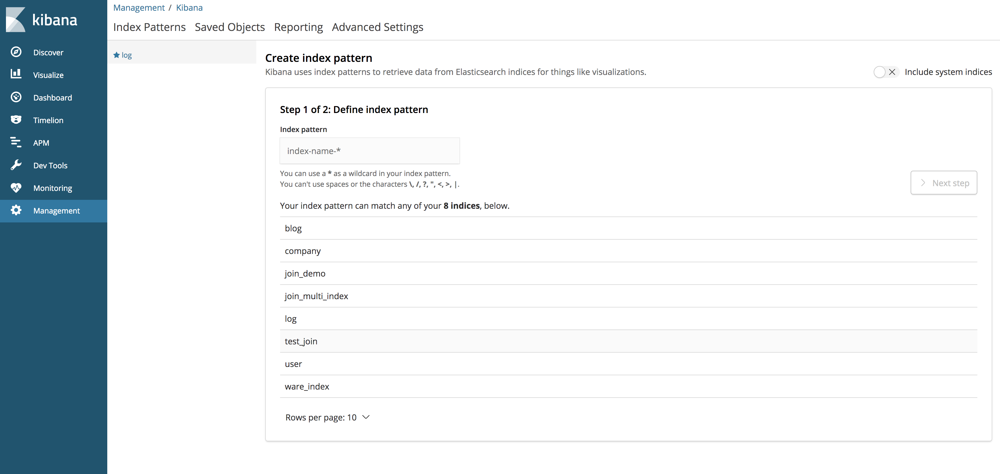

# 实战：ELK日志分析系统

ElasticSearch、Logstash、Kibana简称ELK系统，主要用于日志的收集与分析。

一个完整的大型分布式系统，会有很多与业务不相关的系统，其中日志系统是不可或缺的一个，集中式日志系统需要收集来自不同服务的日志，对它进行集中管理存储以及分析。ELK就是这样一个系统。

ElasticSearch是一个开源分布式搜索引擎，在ELK系统中提供对数据的搜索、分析、存储。

Logstash主要用于日志的收集，在ELK系统中作为日志数据源的传输。

Kibana则是一个可视化管理工具，在ELK系统中起可视化分析查看的作用。

## 安装部署ELK

### ElasticSearch

ElasticSearch的安装在"准备工作"中已经说明，这里不再赘述。

### Kibana

Kibana6.3.2下载地址（Linux、mac OS、Windows对应不同的版本）：[https://www.elastic.co/cn/downloads/past-releases/kibana-6-3-2](https://www.elastic.co/cn/downloads/past-releases/logstash-6-3-2)。Logstatsh历史版本下载页面：[https://www.elastic.co/cn/downloads/past-releases#kibana](https://www.elastic.co/cn/downloads/past-releases#kibana)。

#### Linux


#### macOS

1. 通过命令```tar -zxvf kibana-6.3.2-darwin-x86_64.tar.gz```解压到当前用户目录(或者其它位置)。
2. 解压后进入```kibana-6.3.2-darwin-x86_64```目录，执行```vim config/kibana.yml```命令，修改配置（注意```yml```格式的配置文件冒号必须有英文空格。

```
server.port: 5601
server.host: "localhost"
elasticsearch.url: "http://localhost:9200"
logging.dest: /Users/yulinfeng/log/kibana.log
```

3. 执行```./bin/kibana```命令启动Kibana。

启动完成，打开浏览器输入```localhost:5061```。


### Logstash

Logstash6.3.2下载地址（Linux、mac OS、Windows通用，下载zip包即可）：[https://www.elastic.co/cn/downloads/past-releases/logstash-6-3-2](https://www.elastic.co/cn/downloads/past-releases/logstash-6-3-2)。Logstash历史版本下载页面：[https://www.elastic.co/cn/downloads/past-releases#logstash](https://www.elastic.co/cn/downloads/past-releases#logstash)。

#### Linux


#### macOS

1. 解压```logstash-6.3.2.zip``` 解压到当前用户目录(或者其它位置)
2. 解压后进入```logstash-6.3.2```目录，执行```vim logstash.conf```配置文件。

```
input {
  tcp {
    mode => "server"
    host => "127.0.0.1"
    port => 4568
  }
}
output {
  elasticsearch {
    hosts => ["localhost:9200"]
    index => "log"
    document_type => "log4j2"
  }
}
```

这个配置的含义为，Logstash的日志采集来源是```4568```端口（后面我们会通过程序代码通过log4j向端口```4568```打印日志）。Logstash的日志向ElasticSearch输出。

3. 执行```./bin/logstash -f logstash.conf```命令启动Logstash。

#### Windows


## 日志源DEMO

在部署Logstash时，我们定义了日志的来源是端口```4568```，接下来我们模拟一个程序利用log4j2通过socket连接将日志发送到```4568```端口，DEMO完整代码地址：[https://github.com/yu-linfeng/elasticsearch6.x_tutorial/tree/master/code/logstash](https://github.com/yu-linfeng/elasticsearch6.x_tutorial/tree/master/code/logstash)。

DEMO的逻辑只有打印日志，主要在```log4j2.xml```需要配置socket方式打印。

```xml
......
<Socket name="logstash-tcp" host="localhost" port="4568" protocol="TCP">
  <PatternLayout pattern="${LOG_PATTERN}" />
</Socket>
......
```

详细代码直接查看源码[https://github.com/yu-linfeng/elasticsearch6.x_tutorial/tree/master/code/logstash](https://github.com/yu-linfeng/elasticsearch6.x_tutorial/tree/master/code/logstash)。

启动Spring Boot程序后，控制台开始输出日志，此时返回浏览器查看```localhost:5061```，点击```Management```菜单，```Index pattern```中输入"log"(即定义的索引Index)，一直下一步即可。



配置完成后，点击```Discover```菜单，就可看到程序DEMO打印的日志，并可进行搜索。现在，就请尽情探索吧。