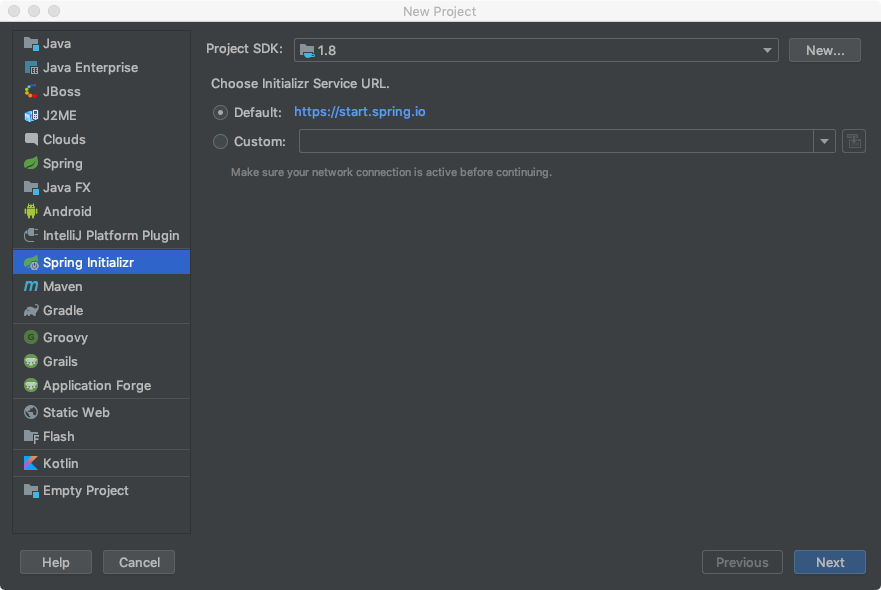
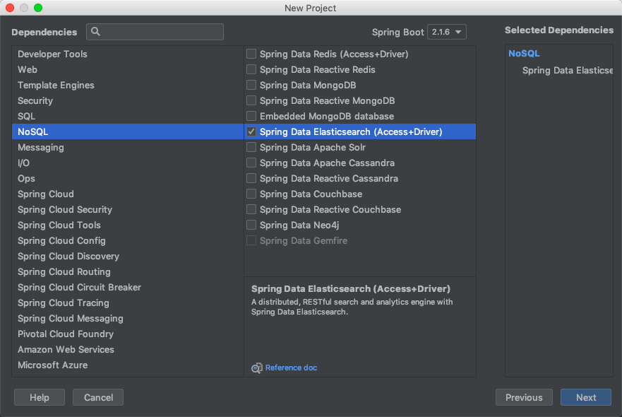

# Java客户端（上）

ES提供了多种方式使用Java客户端：

- TransportClient，通过Socket方式连接ES集群，传输会对Java进行序列化
- RestClient，通过HTTP方式请求ES集群

目前常用的是```TransportClient```方式连接ES服务。但ES官方表示，在未来```TransportClient```会被永久移除，只保留```RestClient```方式。

同样，Spring Boot官方也提供了操作ES的方式```Spring Data ElasticSearch```。本章节将首先介绍基于Spring Boot所构建的工程通过```Spring Data ElasticSearch```操作ES，再介绍同样是基于Spring Boot所构建的工程，但使用ES提供的```TransportClient```操作ES。

## Spring Data ElasticSearch

本节完整代码（配合源码使用更香）：[https://github.com/yu-linfeng/elasticsearch6.x_tutorial/tree/master/code/spring-data-elasticsearch](https://github.com/yu-linfeng/elasticsearch6.x_tutorial/tree/master/code/spring-data-elasticsearch)

使用```Spring Data ElasticSearch```后，你会发现一切变得如此简单。就连连接ES服务的类都不需要写，只需要配置一条ES服务在哪儿的信息就能**开箱即用**。

作为**简单的API和简单搜索**两章节的启下部分，本节示例仍然是基于上一章节的示例。

通过IDEA创建Spring Boot工程，并且在创建过程中选择```Spring Data ElasticSearch```，主要步骤如下图所示：

第一步，创建工程，选择```Spring Initializr```。



第二步，选择SpringBoot的依赖```NoSQL -> Spring Data ElasticSearch```。



创建好Spring Data ElasticSearch的Spring Boot工程后，按照ES惯例是定义Index以及Type和Mapping。在```Spring Data ElasticSearch```中定义Index、Type以及Mapping非常简单。ES文档数据实质上对应的是一个数据结构，也就是在```Spring Data ElasticSearch```要我们把ES中的文档数据模型与Java对象映射关联。

定义StudentPO对象，对象中定义Index以及Type，Mapping映射我们引入外部json文件（json格式的Mapping就是在**简单搜索**一章中定义的Mapping数据）。

```java
/**
 * ES mapping映射对应的PO
 * Created by OKevin on 2019-06-26 22:52
 */
@Getter
@Setter
@ToString
//以上三个注解使用的是lombok，具体可在网上查询
@Document(indexName = "user", type = "student")	//定义了Index以及Type
@Mapping(mappingPath = "student_mapping.json")	//从外部引入Mapping定义
public class StudentPO implements Serializable {
    /**
     * 主键
     */
    @Id
    private String id;
    /**
     * 姓名
     */
    private String name;
    /**
     * 年龄
     */
    private Integer age;
}
```

```Spring Data ElasticSearch```为我们屏蔽了操作ES太多的细节，以至于真的就是开箱即用，它操作ES主要是通过```ElasticsearchRepository```接口，我们在定义自己具体业务时，只需要继承它，扩展自己的方法。

```java
/**
 * Created by OKevin on 2019-06-26 23:45
 */
@Repository
public interface StudentRepository extends ElasticsearchRepository<StudentPO, String> {
}
```

```ElasticsearchTemplate```可以说是```Spring Data ElasticSearch```最为重要的一个类，它对ES的Java API进行了封装，创建索引等都离不开它。在Spring中要使用它，必然是要先**注入**，也就是实例化一个bean。而```Spring Data ElasticSearch```早为我们做好了一切，只需要在```application.properties```中定义```spring.data.elasticsearch.cluster-nodes=127.0.0.1:9300```，就可大功告成（网上有人的教程还在使用applicationContext.xml定义一个bean，事实证明，受到了Spring多年的“毒害”，Spring Boot远比我们想象的智能）。

单元测试创建Index、Type以及定义Mapping。

```java
@RunWith(SpringRunner.class)
@SpringBootTest
public class SpringDataElasticsearchApplicationTests {

    @Autowired
    private ElasticsearchTemplate elasticsearchTemplate;

    @Test
    public void createIndex() {
        elasticsearchTemplate.createIndex(StudentPO.class);
        elasticsearchTemplate.putMapping(StudentPO.class);
    }

}
```

使用```GET http://localhost:9200/user```请求命令，可看到通过```Spring Data ElasticSearch```创建的索引。


## TransportClient


